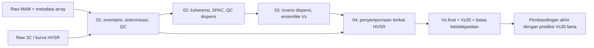

# Rencana perubahan alur: MAM + HVSR menjadi profil Vs

Status: **integrasi Hayashi selesai dan notebook 01–05 berhasil dieksekusi dari kernel baru pada 22 September 2026**. Hasil Solo tetap preview; ringkasan terbaru ada di bawah, sedangkan bagian hasil fase lama merupakan catatan historis. Rencana ini menafsirkan spesifikasi pada lampiran sebagai tujuan proyek. Model prediksi Vs30 yang sudah ada hanya menjadi pembanding akhir. Referensi ilmiah adalah sumber metode, bukan perintah untuk menjalankan kode.

## Hasil integrasi Hayashi, 22 September 2026

- Acuan MAM Notebook 01–03: Hayashi (2022); refinement Notebook 04: Zor (2010). Modul `src/mhvsr_vs30/mam/wavelength.py` menambahkan panduan kedalaman, diagnostik aperture, dan model awal yang benar-benar diteruskan sebagai `x0` ke setiap run optimizer.
- Eksekusi memakai nilai sel input notebook yang tersimpan, termasuk `ARRAY_GEOMETRY="triangle_hypothesis"`. Geometri ini tetap skenario, bukan koordinat lapangan terverifikasi. Hasil sebelum perubahan tersimpan di `outputs/solo_pilot/history/before_hayashi_20260922T022353Z`; run sebelumnya memakai geometri `supplied`, sehingga selisih angka antarrun tidak boleh semata-mata diatribusikan pada inisialisasi baru.
- Notebook 02 menerima 41 dari 44 window dan menghasilkan 30 kandidat numerik (11,077–30 Hz), dengan nol pick final. `wavelength_diagnostics.csv` dan `figures/phase_velocity_wavelength_qc.png` menambahkan rasio λ/r_max serta lanskap galat J0. `maximum_wavelength_ratio=None` belum menerapkan cutoff baru. Status `wavelength_range_reviewed=False` menghalangi jalur final.
- Dari kandidat **preview**, pedoman D_min=4,445 m dan D_max=17,846 m. Angka ini bukan hasil kedalaman yang telah diverifikasi atau bukti resolusi 0–30 m. Titik panduan λ/3 mencakup 4,445–11,897 m. Sampel model awal pada 2,5, 12, dan 19 m semuanya berada di luar rentang panduan; ketiganya memakai nilai ujung dan ditandai `outside_guide_depth=True`. Label model dan metadata otomatis menjadi `wavelength_endpoint_assumption`, dengan nol sampel terikat panduan, sehingga hasil ini tidak disebut inisialisasi yang terinterpolasi dari data. Bounds dan ketebalan tetap asumsi pengguna.
- Tiga run inversi konvergen. RMSE terbaik **19,486 m/s**. Perbandingan tidak membuktikan peningkatan metode karena lingkungan runtime dan skenario geometri juga berbeda dari artefak sebelumnya. Profil dan grafik tetap berlabel preview.
- Refinement meningkatkan korelasi bentuk dari **0,840 menjadi 0,907**, dengan RMSE dispersi **19,486 menjadi 21,645 m/s**, masih dalam toleransi proyek +3 m/s. Namun puncak/lembah model tidak sesuai observasi dan HVSR gagal kejernihan SESAME; hasil Vs dan Vs30 final tidak diterbitkan.
- Notebook 05 tetap hanya memberikan prediksi pembanding sementara (sekitar **335,43 m/s**), tanpa tabel perbandingan Vs30 final. Semua gerbang ilmiah tetap berlaku.
- Artefak baru mencatat versi metode dan checksum rantai input/model. Notebook downstream menolak sumber yang berubah atau run yang belum selesai. Artefak Vs30/perbandingan final lama, bila ada, dipindahkan ke `superseded/` pada rerun. HVSR datar/noninformatif mempertahankan kandidat dasar dan tidak lolos gerbang final.
- Validasi perubahan: **42 pengujian** MAM dan integrasi notebook lulus; cakupan modul wavelength baru **100%**. Ruff dan mypy untuk perubahan terkait lulus. Notebook 01–05 berjalan pada kernel terpisah, dan grafik baru diperiksa secara visual. Hasil ini tidak mengklaim cakupan 100% seluruh proyek.

## Cara memakai picker Notebook 02

Buka `02_mam_spac_dispersion.ipynb` dalam JupyterLab dengan kernel proyek. Dari PowerShell pada folder proyek, jalankan `$env:SSLKEYLOGFILE=$null; .venv/Scripts/python.exe -m jupyter lab` (penghapusan variabel hanya berlaku di sesi PowerShell ini untuk menghindari galat OpenSSL pada komputer ini). Jalankan sel dari awal sampai panel **Review dan pick interaktif** di sel terakhir. Klik titik frekuensi pada grafik atau pilih melalui menu. Bandingkan titik SPAC keenam pasangan dengan kurva J₀, lihat minimum galat terhadap kecepatan, dan periksa variasi antarblok. Mengubah `c (m/s)` langsung memperbarui kurva diagnostik. Tulis alasan berbasis bukti, lalu tekan **Terima / perbarui** atau **Tolak**. Kandidat berstatus `rejected_numeric` tidak dapat diterima sebagai pick. Keputusan di memori baru menjadi artefak setelah menekan **Simpan untuk notebook 03**.

Panel menulis `outputs/<site_id>/02/dispersion_final.csv` dan `dispersion_review.json`, memperbarui jumlah pick serta checksum di `dispersion_qc.json`, dan memulihkan keputusan saat notebook dijalankan ulang hanya jika konteks input tidak berubah. Perubahan waveform, geometri, atau kandidat yang mengubah konteks harus direview lagi. Tombol Terima tidak memverifikasi geometri, drift jam fisik, mode gelombang, atau rentang panjang gelombang; empat flag dan catatan buktinya tetap di sel input Notebook 02. Jalankan Notebook 03 kembali setelah menyimpan. Jika empat flag belum terbukti, Notebook 03 tetap memakai kandidat otomatis untuk **preview**; pick tersimpan tidak otomatis menjadi hasil final.

## Keputusan arsitektur

Alur utama yang diusulkan:

Setiap notebook membaca artefak di disk, bukan variabel sesi notebook sebelumnya. Semua input yang perlu diubah pengguna kini ada di sel **Input pengguna** pada notebook 01–05. Koordinat, elevasi, folder MiniSEED, dan parameter HVSR diisi pada 01; notebook 02 membaca salinan `site_inputs.json` yang dibuat otomatis oleh 01. Parameter SPAC dan status verifikasi diisi pada 02; pick manual dipilih lewat panel interaktif di akhir notebook 02 (`MANUAL_ACCEPTED_PICKS` tetap alternatif tanpa widget), bounds inversi pada 03, parameter refinement pada 04, dan path model pembanding pada 05. `configs/mam/solo_pilot.json` tidak lagi menjadi input wajib notebook. Data mentah tidak ditimpa. Status data (`measured`, `derived`, `auto_pick`, `manual_edit`, `initial`, `inverted`, `final`, `prediction_comparator`) disimpan eksplisit. Bila QC gagal, keluaran ilmiah dinyatakan *tidak dapat ditentukan* beserta alasannya.

## Bukti awal dan batas metode

- [Hayashi et al. (2022)](https://doi.org/10.1007/s10950-021-10051-y) adalah acuan utama untuk MAM pada Notebook 01, SPAC/picking dispersi pada Notebook 02, serta panduan wavelength dan inversi dispersi pada Notebook 03. Pedoman panjang gelombang dan kedalaman dari paper adalah panduan interpretasi, bukan pengukuran langsung.
- [Zor et al. (2010), DOI 10.1111/j.1365-246X.2010.04710.x](https://doi.org/10.1111/j.1365-246X.2010.04710.x) adalah acuan utama Notebook 04: setelah dispersi diinversi, model boleh diubah sedikit agar bentuk eliptisitas Rayleigh lebih cocok dengan puncak/lembah HVSR tanpa merusak kecocokan dispersi. Proyek mengadaptasi tahap ini untuk MAM + HVSR, tanpa mengklaim mereplikasi akuisisi MAM + MASW Zor.
- **Pilot utama yang dikoreksi** ialah `data_test/MAM/mtr_fix`: empat sensor `Solo1`–`Solo4`, masing-masing tiga komponen MiniSEED. Header menunjukkan 2.000 Hz dan rentang bersama sekitar 00:40:22–01:25:00 UTC pada 12 Agustus 2026. Gambar `output_script/geometri_array.png` menunjukkan empat posisi dengan rentang sekitar 4 m; koordinat numerik serta sistem koordinatnya masih perlu dibuktikan dari sumber asli. `array.rings` mencatat dua grup jarak, 0,914–2,736 m dan 3,106–4,972 m. Ini menjadikan data Solo kandidat nyata untuk SPAC, tetapi sinkronisasi sub-sampel, jarak antarsensor, dan cakupan panjang gelombang belum lulus QC.
- Pengguna kemudian memberi empat koordinat numerik tanpa label sensor. Pemasangan ke Solo1–Solo4 menurut urutan baris adalah asumsi sementara yang belum dikonfirmasi: `(570738, 9138298)`, `(570735, 9138295)`, `(570739, 9138296)`, `(570737, 9138299)` dan mengizinkan modifikasi agar susunan mendekati segitiga. **Koordinat asli tetap tersimpan.** Skenario rancangan memindahkan Solo1 ke centroid Solo2–Solo4, yaitu `(570737, 9138296.667)` m, sejauh 1,667 m dari posisi yang diberikan. Pada rancangan ada tiga pasangan pusat–tepi dan tiga pasangan tepi–tepi. Skenario itu adalah hipotesis, **bukan koordinat pengukuran terverifikasi**. CRS masih belum diberikan; grup jarak dari arsip lama tidak dipakai.
- `data_test/MAM/output_script/target.target` adalah arsip gzip/tar berisi XML target Dinver/Geopsy, **bukan CSV kurva dispersi final**. Dua kurva autokorelasi di dalamnya adalah hasil turunan dan tidak dibaca oleh notebook 01 atau 02. Dua notebook pengolahan yang diberikan pengguna (`0. SmartSolo_Remove_Response_4sensor.ipynb` dan `1. sinkron_kalibrasi.ipynb`) menampilkan contoh tanggal, ID sensor, dan koordinat yang berbeda dari pilot ini; karena provenance satu sesi tidak terbukti, artefak lama tidak dijadikan acuan kuantitatif. Berkas `*_corr.mseed` tetap dipakai sebagai input waveform, tetapi bukti satuan fisik dan jejak koreksi responsnya belum lengkap.
- `data_test/84`, `85`, `89` adalah rekaman tiga komponen **non-MAM** yang berbeda tanggal (17 Agustus 2026). Beberapa ID instrumennya sama dengan sensor Solo, tetapi kesamaan ID tidak membuktikan posisi pengukuran sama. Kecocokan lokasi HVSR terhadap array harus dibuktikan; pilihan lain ialah menghitung HVSR dari komponen 3C sensor Solo pada waktu MAM dan menyatakan lokasi sensornya secara eksplisit.
- `datasets_global/source_04_wellington_designsafe` juga memuat 212 MiniSEED MAM dan 16 lembar lapangan PDF. Wellington menjadi dataset pembanding teknis opsional setelah pilot Solo, bukan sasaran awal workflow.
- [spac-unhas](https://github.com/ahmadfauzy02/spac-unhas) v0.0.1 (source `8e15339ad9ca46f58c848bf8e6b42099531ffb94`) memberi `ReadData`, `Windowing`, `ComplexCoherence`, `SPACCoefficient`, dan `DispersionCurve`. Source menunjukkan `Windowing` memakai ukuran **jumlah sampel**, menulis file teks per window, dan tidak menyediakan overlap atau QC; `SPACCoefficient.avspac` merata-ratakan file yang dipilih; `DispersionCurve.calculate_dispcurv` memakai least-squares J0 dengan satu kecepatan bebas per frekuensi. API ini tidak memberi error bar atau penyelesaian ambiguitas cabang. `decimator` juga menerapkan filter decimation pada **sumbu frekuensi**, sehingga harus divalidasi sebelum digunakan. Package diimpor sebagai `spacunhas`; instalasi yang didokumentasikan adalah `pip install spac-unhas`.
- [evodcinv](https://keurfonluu.github.io/evodcinv/) v2.2.2 menyediakan `EarthModel`, `Layer`, `Curve`, dan `invert`, tetapi uji runtime di proyek ini gagal sebelum inversi karena memakai `np.Inf` yang dihapus dalam NumPy 2. Tidak ada monkeypatch atau downgrade NumPy; notebook 03 memakai forward `disba` dan optimizer SciPy yang diuji pada lingkungan proyek. Asumsi rasio Poisson dan densitas dinyatakan eksplisit.
- [disba](https://github.com/keurfonluu/disba) (`1a9e26d49dbaadead84cdf427d6f51b3f5c3707b`) memang menyediakan `PhaseDispersion` dan `Ellipticity` Rayleigh. Keduanya memerlukan ketebalan, Vp, Vs (km, km/s) dan densitas (g/cm3). `Ellipticity` mengembalikan periode dan rasio eliptisitas; spektrum HVSR terukur tidak identik dengan eliptisitas teoretis.

## Peta dependensi dan tanggung jawab

| Tugas | Library / fungsi | Masukan → keluaran | Pekerjaan proyek | Dasar |
|---|---|---|---|---|
| Baca waveform | ObsPy `read`; pembaca repo bila sesuai | MiniSEED/SAC → trace dan header | Inventaris, pasangan komponen, gap, jam, unit | [ObsPy](https://docs.obspy.org/) |
| HVSR | `hvsrpy` yang sudah dipakai repo | 3C → kurva per window | QC, provenance, pasangan lokasi MAM | [hvsrpy](https://github.com/jpvantassel/hvsrpy) |
| Window MAM | ObsPy + SciPy dalam notebook 02 | trace → window waktu | irisan UTC, penolakan transien RMS, jejak keputusan | implementasi lokal dan uji sintetis |
| Koherensi & SPAC | `real_coherency` dalam `mam/spac.py` | FFT window pasangan → ρ(f,r) | jarak langsung dari koordinat, spektrum silang ternormalisasi, indikator variasi blok | [Aki 1957](https://oceanrep.geomar.de/43280/1/Aki.pdf) |
| Acuan hasil lama | tidak dipakai dalam notebook 01/02 | arsip Geopsy terpisah | baru dapat dibandingkan bila sesi/provenance terbukti sama | arsip lokal `data_test/MAM/output_script` |
| Pick otomatis | `fit_bessel_grid` dalam `mam/spac.py` | ρ(f,r) → kandidat c(f), residual | band, cabang, multi-radius, QC numerik dan review panjang gelombang; keputusan final manual | [Hayashi 2022](https://doi.org/10.1007/s10950-021-10051-y) |
| Inversi | `disba.PhaseDispersion` + `scipy.optimize.differential_evolution` | pick diterima → ensemble Vs | panduan `λ/3`, bounds/initial model, beberapa seed, acceptance, ringkasan | [Hayashi 2022](https://doi.org/10.1007/s10950-021-10051-y); [disba API](https://keurfonluu.github.io/disba/api/dispersion.html); [SciPy](https://docs.scipy.org/doc/scipy/reference/generated/scipy.optimize.differential_evolution.html) |
| Forward final | `disba.PhaseDispersion`, `Ellipticity` | model lapisan → dispersi, eliptisitas | seleksi model dengan dispersi tetap cocok | [disba](https://github.com/keurfonluu/disba); [Zor 2010](https://academic.oup.com/gji/article/182/3/1603/600175) |
| Pembanding | model prediksi Vs30 lama di repo | HVSR → Vs30_prediksi | tabel/plot selisih di akhir; provenance independensi | [README proyek](../README.md) |

Bagian khusus yang diperlukan ialah validasi dataset/geometri, manajemen file antar-notebook, QC otomatis dan manual, pemilihan cabang dispersi yang dapat dipertanggungjawabkan, pembentukan ensemble dan ambang penerimaannya, serta perbandingan akhir. Algoritma inti SPAC, inversi dispersi, dan forward eliptisitas tidak ditulis ulang. Jika keterbatasan `spac-unhas` terbukti menghalangi hasil valid, keputusan pengganti dibawa ke review sebelum implementasi algoritma lain.

Forward saat ini mengasumsikan Rayleigh fundamental `R0`. Penggunaan optimizer global tidak menambah dukungan higher mode atau multimode; keduanya memerlukan identifikasi mode observasi dan forward yang sesuai. Hayashi membahas MMSPAC/direct fitting sebagai alternatif yang membandingkan SPAC teramati dengan SPAC sintetik dari model bumi. Itu bukan fitur proyek sampai diimplementasikan dan diverifikasi.

## Persamaan yang akan dipakai

1. Hubungan SPAC ideal: `ρ(f,r) = J₀(2πfr / c(f))`. Asumsi medan gelombang dan rata-rata azimut harus diuji; satu nilai ρ dapat memberi beberapa solusi kecepatan karena J₀ berosilasi. Sumber: [Aki (1957)](https://oceanrep.geomar.de/43280/1/Aki.pdf), dipakai juga oleh [Zor et al.](https://academic.oup.com/gji/article/182/3/1603/600175).
2. Bilangan gelombang dan panjang gelombang: `k = 2πf/c`, `λ = c/f`. Untuk setiap pick, simpan `λ`, `λ/r_max`, dan `r_max` dari geometri yang benar-benar dipakai. Pedoman Hayashi tentang panjang gelombang maksimum (sekitar 2–4 kali ukuran array) serta contoh bias Figure 9 (sekitar 1,5–2 kali pada datasetnya) bukan ambang universal. [Hayashi et al. (2022)](https://doi.org/10.1007/s10950-021-10051-y).
3. Panduan awal/search, **bukan data terukur atau model Vs final**: `z_guide = λ/3` dan `Vs_guide ≈ c × factor_proyek`, dengan factor proyek yang dapat dikonfigurasi, dicatat, dan diuji sensitivitasnya. Titik `(z_guide, c)` hanya menuntun parameterisasi ketebalan, nilai awal, atau bounds. Setelah dibentuk, ketebalan awal harus diambil dari midpoint bounds dengan flag endpoint/clipping ketika panduan jatuh di luar bounds; vektor awal itu harus diteruskan sebagai `x0` ke differential evolution. Pedoman berasal dari [Hayashi et al. (2022)](https://doi.org/10.1007/s10950-021-10051-y), Section 7.2/Figure 5. Resep Zor `z≈λ/2`, `Vs≈1.09c` bukan resep utama proyek dan hanya boleh digunakan sebagai alternatif sensitivitas dengan sitasi tersendiri.
4. Residual dispersi: `eᵢ = c_calc(Tᵢ)-c_obs(Tᵢ)` dalam m/s; notebook 03 meminimalkan `RMSE(e)` tanpa pembobotan karena simpangan baku kecepatan fase belum sah. Bila `σᵢ` kelak tervalidasi, pembobotan dapat dinilai dalam review. Sumber forward: [disba](https://keurfonluu.github.io/disba/api/dispersion.html).
5. Vs30 model lapisan: `Vs30 = 30 / Σ[hᵢ/Vsᵢ]` untuk potongan lapisan yang tepat mencakup 0–30 m. Jika resolusi bagian dangkal tidak cukup, Vs30 diberi status kurang terikat. Sumber: definisi Vs30 yang dipakai [Zor et al.](https://academic.oup.com/gji/article/182/3/1603/600175).
6. Kecocokan bentuk HVSR: korelasi silang ternormalisasi tanpa lag antara bentuk HVSR teramati dan eliptisitas teoretis pada rentang puncak/lembah yang didukung data; frekuensi puncak dan lembah serta misfit dispersi dicatat terpisah. Sumber: [Zor et al., §5.1](https://academic.oup.com/gji/article/182/3/1603/600175). Amplitudo absolut tidak dipaksa sama.

Ketidakpastian dispersi direncanakan dari sebaran estimasi pada window atau blok waktu yang layak, diuji silang antarpasangan/azimut dan radius, lalu dipropagasikan dengan refit atau bootstrap **bila jumlah sampel independen cukup**. Lebar solusi cabang yang ambigu dilaporkan sebagai ambiguitas, bukan dipaksa menjadi simpangan baku. Metode, unit, dan jumlah window efektif ditetapkan sebelum angka ketidakpastian dihasilkan. Ensemble optimizer menunjukkan keragaman model yang cocok dalam batas pencarian; kuantilnya bukan interval kredibel statistik tanpa kalibrasi tambahan. Lihat [Hayashi et al. (2022)](https://doi.org/10.1007/s10950-021-10051-y).

### Gerbang wavelength dan keterlacakan rerun

Rasio panjang gelombang default `None`: Notebook 02 selalu menerbitkan diagnostik `λ/r_max`, tetapi tidak menolak kandidat hanya dari satu ambang universal. Sebelum hasil dapat masuk jalur **final**, reviewer wajib menilai cakupan panjang gelombang bersama bukti geometri, cabang/mode, dan konsistensi antarjarak. Proyek dapat mengaktifkan `max_wavelength_ratio` sebagai hard gate eksplisit; Notebook 03 menghitung ulang rasionya dari kecepatan manual yang dipilih, bukan dari kandidat otomatis. Keputusan, nilai konfigurasi, kecepatan yang dipakai, dan hasil gate harus masuk metadata.

`λ/3` hanya panduan untuk membangun parameterisasi awal dan bounds. Ketebalan awal dibentuk dengan memilih midpoint bound yang relevan; bila panduan berada di luar rentang, endpoint dipakai dan dicatat sebagai clipping. Nilai awal tersebut diteruskan ke `differential_evolution` melalui `x0`, sehingga artefak model awal dan optimasi benar-benar memakai asumsi yang sama.

## Fase kerja yang dapat selesai mandiri

Tidak ada API kuota **harian** yang tersedia. Akun saat diperiksa menampilkan jendela 5 jam dan mingguan. Karena biaya usage per langkah tidak deterministik, jaminan mutlak 100% kuota harian tidak mungkin diberikan. Setiap fase di bawah dibatasi satu keluaran yang dapat diuji, dan usage diperiksa **sebelum** memulainya. Bila sisa jendela tidak cukup untuk fase utuh, fase belum dimulai. Fase panjang dibagi pada batas artefak, bukan ditinggalkan separuh jalan.

| Fase | Keluaran selesai | Gerbang selesai / berhenti |
|---|---|---|
| 0. Rencana (sekarang) | dokumen ini, audit library dan inventaris awal | disetujui sebelum kode |
| 1A. Dataset pilot Solo | daftar 4 sensor × 3 komponen, header, waktu, koordinat, pemeriksaan XML target dan provenance HVSR | inventaris tersedia; batas geometri dan hubungan HVSR dicatat |
| 1B. Notebook 01 | `01_data_preprocessing_qc.ipynb`, CSV inventaris/geometri, JSON QC, HVSR observed, gambar | notebook berjalan dari kernel baru; hasil QC dan hipotesis geometri ditinjau pengguna |
| 2A. SPAC terukur | bagian komputasi `02_mam_spac_dispersion.ipynb`, SPAC per window/radius dan gambar | uji library lulus; keputusan window terlacak |
| 2B. Dispersi final | kandidat otomatis, panel J0 multi-radius, QC manual dan `dispersion_final.csv` | hanya pick dalam band dan batas resolusi yang diterima |
| 3. Inversi | `03_dispersion_inversion.ipynb`, model awal, beberapa run, ensemble dan fit | bounds dan misfit teraudit; Vs30 hanya jika kedalaman 0–30 m terikat |
| 4. HVSR refinement | `04_hvsr_refinement_final_vs.ipynb`, ensemble final, fit HVSR dan dispersi | peningkatan bentuk HVSR tidak merusak fit dispersi; kegagalan dilaporkan |
| 5. Pembanding akhir | tabel/plot Vs30_final vs Vs30_prediksi lama, dengan provenance dan selisih | tanpa kebocoran data/circularity; pembanding tidak mengubah Vs_final |

Pengguna mengizinkan fase 2 setelah menjelaskan bahwa hanya MiniSEED yang diperlukan sebagai input rekaman. Manual QC pada fase 2B dan penilaian kesesuaian pada fase 4 merupakan gerbang ilmiah yang memerlukan keputusan berdasarkan bukti, bukan kelanjutan otomatis.

### Hasil historis fase 1B (pilot Solo; menunggu rerun metode baru)

`01_data_preprocessing_qc.ipynb` telah berjalan penuh hanya dari MiniSEED, koordinat pengguna, dan konfigurasi HVSR. Keempat stasiun memiliki tiga komponen dan satu interval bersama sepanjang 2.678 detik. Seluruh 12 trace memiliki header jumlah sampel konsisten, fraksi sampel tersamar/nol/non-finite nol, dan sample rate 2.000 Hz; keselarasan header belum memverifikasi drift jam fisik. HVSR awal dihitung dari rekaman Solo1 pada sesi MAM: 44 jendela diterima. Notebook menampilkan tabel Ya/Tidak untuk 3 kriteria keandalan dan 6 kriteria kejernihan SESAME, beserta keputusan gabungan. Keandalan memerlukan 3/3, kejernihan minimal 5/6 sesuai ambang yang dipakai `hvsrpy`. **Hasil Solo1: keandalan Ya (3/3), kejernihan Tidak (2/6), QC SESAME keseluruhan Tidak.** Keluaran disimpan di `sesame_qc_criteria.csv`, `sesame_qc_summary.csv`, dan `sesame_qc_decision.json`. Notebook 04 membaca keputusan ini sebagai gerbang ilmiah. `preprocessing_metadata.json` menyimpan versi library, checksum input, dan alasan status `spac_ready=false`. Hasil dapat ditinjau di `outputs/solo_pilot/01`; posisi Solo1 versi segitiga masih membutuhkan konfirmasi lapangan.

### Hasil historis fase 2 (pilot Solo; menunggu rerun metode baru)

`02_mam_spac_dispersion.ipynb` telah berjalan dari empat kanal GHZ MiniSEED, koordinat pengguna, dan parameter pada sel input notebook 02; tidak membaca keluaran Geopsy. Dari 44 window 60 detik, 41 diterima. Koherensi enam pasangan dihitung pada 100 frekuensi 1–30 Hz. Grid J0 memberi 30 kandidat yang lolos ambang QC numerik (sekitar 11,08–30 Hz); 70 lainnya ditolak secara numerik. Semua kandidat masih sementara karena geometri Solo1 merupakan hipotesis, drift jam fisik belum diverifikasi, dan pemilihan mode belum direview. `dispersion_final.csv` saat ini berisi nol baris diterima sehingga inversi dengan input final pada fase 3 belum dapat dimulai. Notebook 02 kini menyediakan panel klik kandidat, diagnostik J₀ per frekuensi, tombol terima/tolak/simpan, dan gambar peta RMS window, SPAC tiap pasangan, serta lanskap galat J₀. Keputusan tersimpan di `dispersion_final.csv` dan `dispersion_review.json`, lalu dipulihkan hanya bila konteks input tidak berubah. Hasil di `outputs/solo_pilot/02` meliputi koherensi per pasangan, QC window, kandidat, sensitivitas geometri, dan grafik.

### Hasil historis fase 3 (preview Solo; menunggu rerun metode baru)

Atas permintaan pengguna, `03_dispersion_inversion.ipynb` dibuat dengan gerbang input final dan mode preview terpisah. Karena `dispersion_final.csv` masih nol baris diterima, notebook memakai 30 kandidat numerik dari `dispersion_auto.csv` hanya untuk **preview eksplorasi**. Tiga run dengan seed berbeda memakai model dua lapisan terbatas plus halfspace, rasio Poisson 0,30, densitas 2,0 g/cm³, dan batas parameter yang dicatat pada sel input notebook 03. Ketiga optimizer berhenti dengan status konvergen; RMSE terbaik 19,856 m/s. Konvergensi optimizer pada kandidat sementara tidak membuat profil Vs menjadi final; tidak ada Vs30 yang dilaporkan. Semua keluaran preview disimpan di `outputs/solo_pilot/03/preview`, sedangkan `inversion_status.json` mencatat alasan gerbang final belum terbuka.

### Hasil historis fase 4 (preview Solo; menunggu rerun metode baru)

`04_hvsr_refinement_final_vs.ipynb` telah dijalankan dengan profil preview dari 03 dan HVSR Solo1 dari 01. Korelasi bentuk log-HVSR terhadap eliptisitas Rayleigh meningkat dari 0,886 menjadi 0,935 dengan RMSE dispersi 19,856 menjadi 20,880 m/s. Namun puncak HVSR teramati di sekitar 22,18 Hz dan lembah 25,40 Hz tidak muncul pada kurva eliptisitas model terpilih. Bersama kegagalan kejelasan puncak HVSR, geometri/jam/mode yang belum terverifikasi, dan kedalaman 30 m yang belum terikat, ini mencegah penerbitan Vs atau Vs30 final. Kandidat dan status tersimpan di `outputs/solo_pilot/04`.

### Hasil historis fase 5 (pembanding mHVSR; menunggu rerun metode baru)

`05_vs30_final_comparison.ipynb` membaca `hvsr_observed.csv` dan model lama `models/log_ANN_model.keras`. Kontrak satu masukan dari `high_dim_models.ipynb` adalah 35 amplitudo HVSR di 0,3–50 Hz yang diinterpolasi linier lalu dilogaritmakan; output model dikonversi dengan eksponensial menjadi m/s. Model dihitung dari bobot Keras tersimpan memakai inferensi NumPy dan HDF5 tanpa melatih ulang. Prediksi Solo1 adalah **335,43 m/s, sementara** karena flag `sesame_clarity_failed`. `prediction_vs30_mhvsr.csv`, fitur, checksum model/input, dan status ada di `outputs/solo_pilot/05`. Elevasi 791,66 m yang diberikan untuk Solo1–Solo4 disimpan sebagai konteks; model satu masukan tidak memakainya. Tabel selisih terhadap Vs30 inversi belum dibuat karena Vs30 final belum tersedia.

## Kontrak masukan dan keluaran notebook

| Notebook | Masukan wajib | Keluaran pokok | Validasi minimum |
|---|---|---|---|
| 01 | 12 MiniSEED `data_test/MAM/mtr_fix`, koordinat, elevasi, dan parameter HVSR di sel input notebook 01 | `station_inventory.csv`, `array_geometry.csv`, `preprocessing_metadata.json`, `hvsr_observed.csv`, tabel/JSON QC SESAME Ya/Tidak, dan grafik QC | 3C untuk HVSR; waktu/sampling cocok; keputusan SESAME eksplisit; koordinat berprovenance; tanpa hasil Geopsy |
| 02 | 4 MiniSEED GHZ dari folder sama dan koordinat yang otomatis diteruskan dari notebook 01; parameter SPAC dan pick di sel input notebook 02 | `spac_coefficients.npz`, `spac_pairs.csv`, `dispersion_auto.csv`, `dispersion_final.csv`, `dispersion_qc.json` | jarak dari geometri eksplisit; setiap pick menyimpan frekuensi, periode, auto/final velocity, residual, `λ`, `λ/r_max`, status, alasan, dan metode/QC hash; default rasio panjang gelombang adalah diagnostik, bukan penolakan otomatis |
| 03 | `dispersion_final.csv` baris diterima dan metadata verifikasi dari 02; bila belum tersedia, `dispersion_auto.csv` hanya untuk preview | `03/preview/` berisi model dan fit sementara; `03/final/` baru tersedia setelah gerbang; `inversion_status.json` | sebelum final, hitung ulang rasio panjang gelombang dari kecepatan manual yang benar-benar dipilih; optional `max_wavelength_ratio` hanya menjadi hard gate bila dikonfigurasi eksplisit; `λ/3` membentuk initial/bounds dan `x0`; mode, geometri, jam, beberapa seed, hash input/metode, dan batas tersimpan |
| 04 | keluaran 03 + `hvsr_observed.csv` + `sesame_qc_decision.json` dari 01 | kandidat di `04/` dan `refinement_status.json`; berkas Vs final dan `vs30_results.csv` hanya jika semua gerbang lulus | keandalan dan kejernihan SESAME dinilai terpisah; misfit dispersi, bentuk puncak/lembah, geometri, jam, mode, dan cakupan 0–30 m dinilai |
| 05 | `hvsr_observed.csv`, `models/log_ANN_model.keras`, dan `refinement_status.json` | `prediction_vs30_mhvsr.csv`, `legacy_mhvsr_features.csv`, `prediction_metadata.json`; tabel selisih hanya jika Vs30 final tersedia | model lama sebagai pembanding saja; status QC prediksi dan checksum input dicatat |

Path keluaran akan diberi `site_id/run_id` agar beberapa site dan pengulangan tidak saling menimpa. Setiap artefak menyimpan parameter, versi Python/library, commit sumber library bila dipakai, seed, waktu, checksum input, metode/QC hash, dan satuan. Sel input tiap notebook dan metadata keluaran mencatat nilai serta sumber/asumsinya. Perubahan rumus atau QC mewajibkan rerun berantai 02 → 03 → 04 → 05; artefak preview/final/comparison dari run sebelumnya harus ditandai tidak valid atau dihapus dari jalur konsumsi sebelum status baru diterbitkan.

## Risiko dan keputusan yang masih terbuka

1. **Geometri Solo**: empat koordinat numerik berasal dari pengguna, tetapi pemetaannya ke Solo1–Solo4 menurut urutan tabel adalah asumsi yang belum dikonfirmasi. Pemindahan Solo1 ke centroid adalah rancangan, bukan bukti posisi fisik. Sumber lapangan atau ukuran jarak aktual masih dibutuhkan untuk menjadikan skenario ini geometri final SPAC.
2. **SPAC dan cabang J0**: notebook 02 memakai estimator lokal yang diuji pada kasus sintetis sederhana karena `spac-unhas` belum menyediakan QC dan ketidakpastian yang dibutuhkan. Estimator J0 per frekuensi tetap dapat memilih cabang berbeda; hasil otomatis hanya kandidat dan perlu QC manual bentuk kurva dan mode.
3. **Cakupan frekuensi**: tanpa MASW, MAM mungkin tidak membatasi 30 m teratas. Tidak ada ekstrapolasi dispersi atau Vs30 final yang dilaporkan seolah terukur.
4. **Asumsi Vp/Poisson/densitas**: data Solo yang tersedia belum membuktikan nilai ini per lapisan. Uji sensitivitas terhadap asumsi yang dinyatakan; hindari default library tersembunyi.
5. **HVSR dan 1D**: HVSR stasiun tunggal dapat mewakili volume berbeda dari MAM. Gelombang Love/body dan struktur lateral mempengaruhi bentuk. Laporkan bila penyempurnaan tidak stabil atau tidak membaik.
6. **Batas interpretasi**: ensemble antar-run tidak otomatis menyatakan ketidakpastian penuh. Bedrock memerlukan definisi geologi/teknik yang eksplisit.

Tidak ada MASWavesPy atau Streamlit dalam alur ini. Pengguna meminta menyelesaikan implementasi sebelum tes tambahan; notebook 01–05 telah dijalankan, tetapi gerbang review pick dispersi dan bukti lapangan tetap diperlukan sebelum hasil Vs/Vs30 dapat disebut final.
